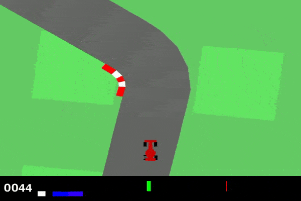
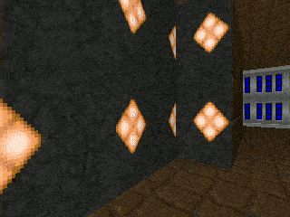

# Deep Reinforcement Learning

  
  
  

# Summary

This repository contains implementations of the majority of the core algorithms in Deep Reinforcement Learning (DRL) as listed below. All the implementations are in Python and based on PyTorch for models, optimizers and training in general. The algorithms can be used with any environment in [Gymnasium](https://github.com/Farama-Foundation/Gymnasium) or other environments that follow the same API of Gymnasium. Each algorithm is implemented standalone and is therefore independent of the implementation of the others even when sharing a lot of overlapping ideas. This was done for easier code readibility for each algorithm. The library is organized into different directories, each encompassing a specific class of DRL algorithms. These currently include the following:

* **Core**: Majority of the main on and off-policy DRL algorithms listed in details below.

* **Exploration**: Algorithms aimed at enhancing the DRL agent's ability at exploring its environment, typically aimed at environments with a sparse reward signal. However, in this context, this also includes algorithms for safe exploration.   

# Features 

* MLP, CNN and CNN-LSTM (Recurrent) Policies

* TensorBoard integration for logging

* Parallel vector environments

* Nvidia GPU support

* Model saving, checkpointing and ability to start training from an existing model's parameters

* Environment saving and loading for both base or arbitrarily wrapped environments

* Policy testing using saved environments and models in addition to easy video recording

* Support for learning rate scheduling

* Parameter sharing for CNN-based architectures (except for TRPO) 

* Return normalization and action rescaling to [-1, 1] for Box action spaces

* Flexible sequence lengths for recurrent policies with adjustable 'burn-in' periods and hidden state management for uninterrupted rollouts

* Extremely customizable algorithm and architecture configurations through scripting or the terminal

# Currently Available Algorithms and Future Developments

## Core

* Deep Q-Learning Network ([DQN](https://doi.org/10.1038/nature14236))
	* Basic DQNs   
	* Double DQNs ([DDQN](	
	https://doi.org/10.48550/arXiv.1509.06461))
	* Dueling DQNs ([DDQN](	
	https://doi.org/10.48550/arXiv.1511.06581))
	* DQNS with Prioritized Experience Replay ([PER](	
	https://doi.org/10.48550/arXiv.1511.05952))

* Advantage Actor-Critic ([A2C](	
https://doi.org/10.48550/arXiv.1602.01783))

* Trust Region Policy Optimization ([TRPO](	
https://doi.org/10.48550/arXiv.1502.05477))	

* Proximal Policy Optimization ([PPO](	
https://doi.org/10.48550/arXiv.1707.06347))

* Deep Deterministic Policy Gradient ([DDPG](	
https://doi.org/10.48550/arXiv.1509.02971))

* Twin Delayed Deep Deterministic Policy Gradient ([TD3](	
https://doi.org/10.48550/arXiv.1802.09477))

* Soft Actor-Critic ([SAC](	
https://doi.org/10.48550/arXiv.1812.05905))

## Exploration

* Curiosity-driven Exploration by Self-supervised Prediction ([CDESP](	
https://doi.org/10.48550/arXiv.1705.05363))

* To do:
	* Hindsight Experience Replay ([HER](	
	https://doi.org/10.48550/arXiv.1707.01495
	))
	* Adaptive Policy ReguLarization ([APRL](	
	https://doi.org/10.48550/arXiv.2310.17634))  

## Hierarchical RL 

* To do:
	* Hierarchical Actor-Critic ([HAC](	
	https://doi.org/10.48550/arXiv.1712.00948))
 	* Double Actor-Critic ([DAC](	
	https://doi.org/10.48550/arXiv.1904.12691))

## Imitation Learning

## Offline RL

## Physics & Model-Based RL

## Other

* To do:
	* Adverserial RL
	* Meta RL
	* Policy Distillation

# Acknowledgments

* OpenAI's [Spinning Up](https://spinningup.openai.com/en/latest/) which was my main source of information (in addition to the original papers) for learning about the core algorithms and Gym.  

* Stable-Baselines3 ([SB3](https://stable-baselines3.readthedocs.io/en/master/)) mainly for clearing up confusions regarding parameter sharing in on-policy algorithms and as a guide for default hyperparamter values. 

* The amazing blogpost: [The 37 Implementation Details of Proximal Policy Optimization](https://iclr-blog-track.github.io/2022/03/25/ppo-implementation-details/#Andrychowicz) by Huang, et al. which dives into all the important details regarding PPO's implementation. 

* The Generalized Advantage Estimation ([GAE](	
https://doi.org/10.48550/arXiv.1506.02438)) paper and the Recurrent Replay Distributed DQN ([R2D2](https://openreview.net/forum?id=r1lyTjAqYX)) paper which cleared many confusions about recurrent policies in general. 

* The amazing book: [Dive into Deep Learning](https://d2l.ai/) by Zhang, Aston and Lipton, Zachary C. and Li, Mu and Smola, Alexander J. for Deep Learning using PyTorch.

* Note: All correspoding papers are linked with their algorithms above. Also, for SAC the link correponds to the 2nd paper that the implementation is based on and that describes automatic temperature coefficient adjustment using Dual Gradient Descent. Meanwhile, the original SAC paper can be found [here](https://arxiv.org/abs/1801.01290).